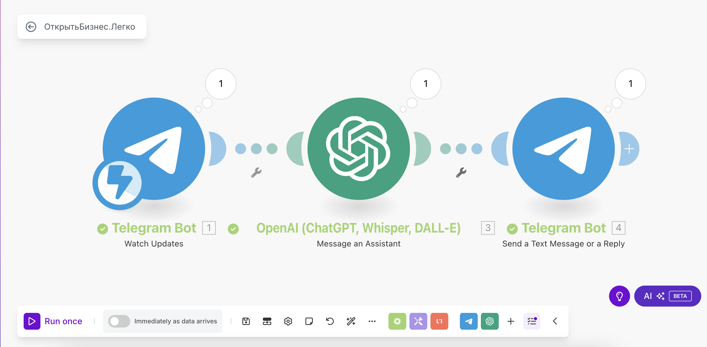

# Интеллектуальный Telegram-бот для юридических консультаций по открытию бизнеса

## О проекте

Автоматизированный чат-бот для Telegram, который круглосуточно отвечает на юридические вопросы по открытию и ведению бизнеса в России.
Бот интегрирован с искусственным интеллектом (OpenAI) и индивидуальной базой знаний на основе законов и нормативных актов.

## Задачи, которые решает бот

- Мгновенные юридические консультации для клиентов 24/7
- Ссылки на законы и нормативные акты в каждом ответе
- Экономия времени ваших специалистов и повышение лояльности клиентов
- Снижение нагрузки на колл-центр и отдел сопровождения
- Сбор статистики и аналитика по обращениям

## Как работает бот

1. Клиент пишет вопрос в Telegram-бот.
2. Бот отправляет вопрос в OpenAI-ассистент с индивидуальной базой знаний.
3. Ассистент возвращает подробный, релевантный ответ с упоминанием закона.
4. Бот отправляет ответ клиенту прямо в чат.

## Интеграции

- Telegram Bot API
- OpenAI (GPT-4, Assistants)
- Make (Integromat) — для автоматизации сценариев

## Пример вопросов для бота

- Какие документы нужны для регистрации ИП?
- Как выбрать систему налогообложения для ООО?
- Нужно ли открывать расчетный счет для ИП?
- Можно ли зарегистрировать ООО на домашний адрес?

## Как развернуть этот проект

1. Создайте Telegram-бота через BotFather.
2. Подключите Telegram и OpenAI к платформе Make.
3. Загрузите свою базу знаний (например, FAQ в формате JSON).
4. Настройте сценарий по инструкции.
5. Протестируйте работу и задайте свои вопросы.

## Скриншоты

### Пример работы бота

### Сценарий Make

## Контакты для заказа аналогичного решения

- Дмитрий  
- Email: d@ifabrique.ru  
- Telegram: @dgmor  
- Официальный интегратор с 2016 года, ТОП-1 по внедрениям в России.

---

**Подарок при заказе**: чек-лист «10 шагов, как увеличить средний чек на 30% с помощью CRM».
